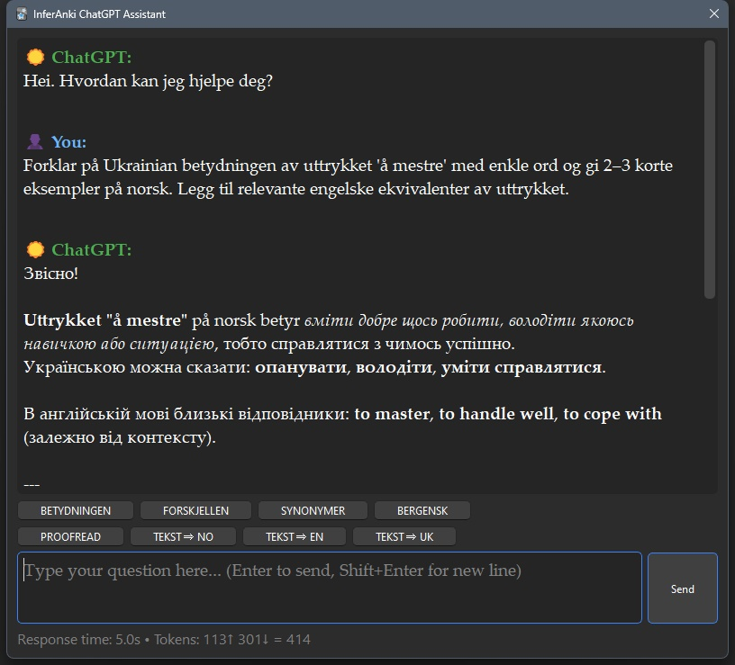

# InferAnki v0.6.5

**Додаток для Anki на базі штучного інтелекту для допомоги у вивченні норвезької мови**

## Що таке Anki?

**Anki** – це **безкоштовна** програма для створення та вивчення флешкарток, що використовує принцип **інтервального повторення**. Це один із найефективніших методів запам’ятовування інформації, науково підтверджений дослідженнями когнітивної психології.

**Офіційний сайт**: https://apps.ankiweb.net/

Anki доступна як на комп’ютері, так і на смартфоні — можна вчитися будь-де, а прогрес синхронізується через хмару.

### Наукове обґрунтування

**Крива забування Еббінгауза** (1885) показує, як швидко ми втрачаємо нову інформацію.

Без повторення ми забуваємо:
- **50%** інформації за 20 хвилин
- **70%** – за день
- **90%** – за тиждень

**Інтервальне повторення** змінює цю картину: повторюючи матеріал у оптимальні проміжки часу, ми переводимо інформацію з короткочасної пам’яті в довготривалу з мінімальними зусиллями.

### Як працює Anki?

Anki обчислює **оптимальні інтервали повторення** для кожної картки. Користувач сам оцінює складність пригадування картки після показу, а програма автоматично визначає дату наступного повторення:
- «Легкі» картки відкладаються на довший термін.
- «Складні» повторюються частіше.

Система адаптується під ваш темп навчання.

**Результат:** замість механічного зазубрювання ви запам’ятовуєте матеріал ефективно та надовго, витрачаючи 15–20 хвилин на день.

### Чому Anki + InferAnki?

InferAnki додає до функціоналу Anki **потужність штучного інтелекту**. Це чотири кнопки на панелі інструментів у редакторі карток:

- ✨ **CardCraft**: генерація повного контенту картки за одним введеним словом. GPT-5.2 підбирає «семантичну родину» для слова, визначення, приклади вживання та додає переклад на обрану користувачем мову.
- 📝 **Examples**: створення додаткових прикладів із наявного тексту у полі 2.
- 👩🏼 **TTS**: озвучення норвезького тексту високоякісним AI-голосом.
- ☀️ **ChatGPT Assistant**: чат з GPT-5.2 для детальних консультацій, зі швидкими промтами та можливістю копіювати результат у буфер обміну (наприклад, для перекладів).

Додаток використовує спеціально налаштовані промти для контролю якості відповідей AI. Користувач може гнучко змінювати ці промти під власні потреби.

## Системні вимоги

⚠️ **Важливо**: Цей додаток працює **тільки на Windows Desktop версії Anki**

 **Причина обмежень**: Додаток інтегрується безпосередньо в редактор карток Anki Desktop через системні hooks, використовує Windows-специфічні шляхи файлової системи та вбудоване у програму Anki Desktop Python-середовище. Це означає, що запустити додаток можна лише під Windows, але користуватися його результатами — згенерованими картками з аудіо — можна і на інших платформах.

### Що необхідно:
- ✅ **Windows 10 або новіша**
- ✅ **Актуальна версія Anki Desktop для Windows**
- ✅ **Вбудовані Python та Qt** (постачаються з Anki)

### НЕ підтримується:
- ❌ AnkiWeb (браузерна версія)
- ❌ AnkiMobile (iOS додаток)
- ❌ AnkiDroid (Android додаток)  
- ❌ macOS/Linux (поки що)

## Встановлення додатку

### Приготуйте необхідні API ключі

**OpenAI API ключ**
- Перейдіть на: https://platform.openai.com/
- Зареєструйтесь/увійдіть в аккаунт
- Створіть API ключ в розділі API Keys та відразу збережіть його в захищене місце!

**ElevenLabs API ключ**
- Перейдіть на: https://try.elevenlabs.io/l8ypk48ku2uk
- Зареєструйтесь/увійдіть в аккаунт
- Створіть API ключ в Налаштуваннях аккаунта та відразу збережіть його в захищене місце!
- Виберіть бажаний голос озвучки та збережіть його id

### Налаштування додатку

1. Перевірте чи у вас встановлена остання версія Anki під Win: https://apps.ankiweb.net/
2. Скопіюйте всю папку inferanki до: `%APPDATA%\Anki2\addons21\`
3. Відкрийте `config.json` в будь-якому редакторі з підсвіткою.
4. Додайте в `config.json` ваші API ключі:
   - Додайте API ключ від OpenAI в поле `openai_api_key`
   - Додайте API ключ від ElevenLabs в поле `elevenlabs_api_key`
   - Додайте id голосу в поле `elevenlabs_voice_id`
5. Запустіть Anki
6. Налаштуйте поля 1 і 2 як показано на малюнках Card setup 1-3

## Використання

1. Відкрийте редактор карток Anki (Додати/Редагувати картку)
2. Введіть норвезьке слово у поле 2
3. Використовуйте кнопки панелі інструментів:
   - ✨ **CardCraft** – щоб додати повний контент у поле 2 та переклад у поле 1
   - 📝 **Examples** – щоб просто додати декілька релевантних прикладів вживання виразу у поле 2 (в полі 2 має бути хоча б одне норвезьке слово)
   - 👩🏼 **TTS-Emma** – додає озвучку поля 2
   - ☀️ **ChatGPT Assistant** – відкриває вікно чату з AI-асистентом

## Інші налаштування

Відредагуйте `config.json` для налаштування:
- Параметри TTS голосу
- Налаштування AI моделі
- Мова перекладу
- Режим відладки

### Налаштування мови перекладу - поле 1

За замовчуванням AI генерує переклади в поле 1 англійською мовою. Доступні мови: будь-які, хоч Клінгонська 👽. Щоб змінити мову перекладу поля 1 на іншу (наприклад, українську) відкрийте `config.json` та замініть:

```json
{
    "field_1_response_lang": "Ukrainian"
}
```

**Примітка:** Додаток автоматично використовує індекси полів у коді – тому назви полів у Анкі ні на що в коді додатку не впливають!

**Налаштування контексту**

Щоб персоналізувати AI-згенеровані приклади для вашої галузі/інтересів:

1. Відкрийте: `prompts.json`
2. Знайдіть: `"user_context": []`
3. Замініть на ваш контекст, наприклад:
   - Медицина: `["medisin", "helse", "sykehus"]`
   - Бізнес: `["økonomi", "business", "ledelse"]`
   - IT: `["programmering", "teknologi", "data"]`
   - Освіта: `["utdanning", "skole", "læring"]`
   - Право: `["jus", "lov", "rettsvesen"]`

Це робить AI приклади більш релевантними до вашої галузі при вивченні норвезької лексики.

### Налаштування чатбота

**Детальна документація:** Дивіться `ChatBot-uk.md` для налаштування квік-промптів, кнопок перекладу та функції копіювання в буфер обміну.

**Пам'ять розмови**: Чатбот запам'ятовує останні 10 пар повідомлень в межах кожної сесії діалогу для зв'язних багатоходових розмов. Кожне нове вікно починається заново.

## Підтримка

- Перевіряйте debug.log на наявність проблем
- Увімкніть debug_mode в config.json для детального логування

### ВАЖЛИВО! ПЕРЕЗАПУСКАЙТЕ ANKI ПІСЛЯ БУДЬ-ЯКОЇ ЗМІНИ НАЛАШТУВАННЬ!!!


### ChatGPT Assistant
