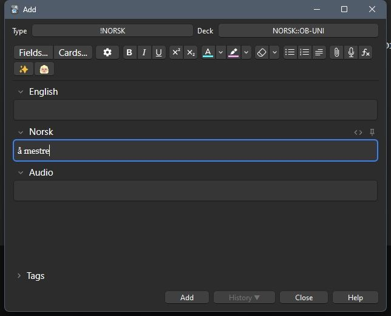
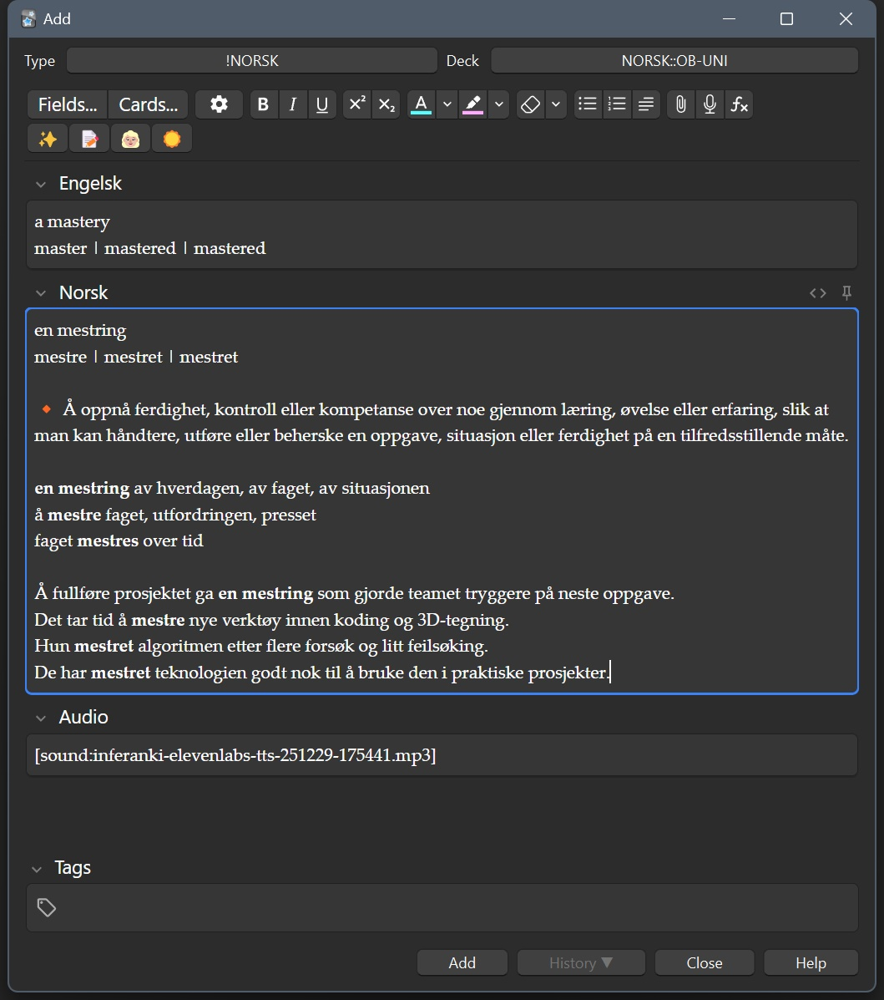
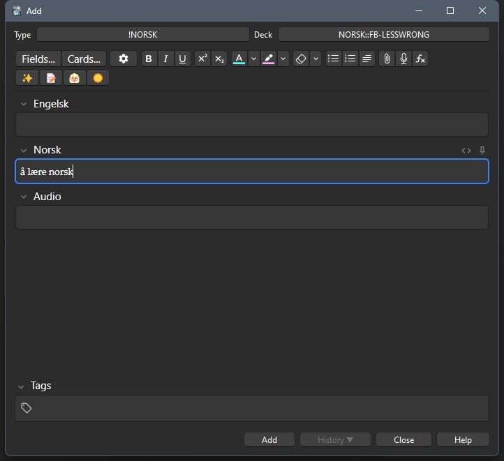
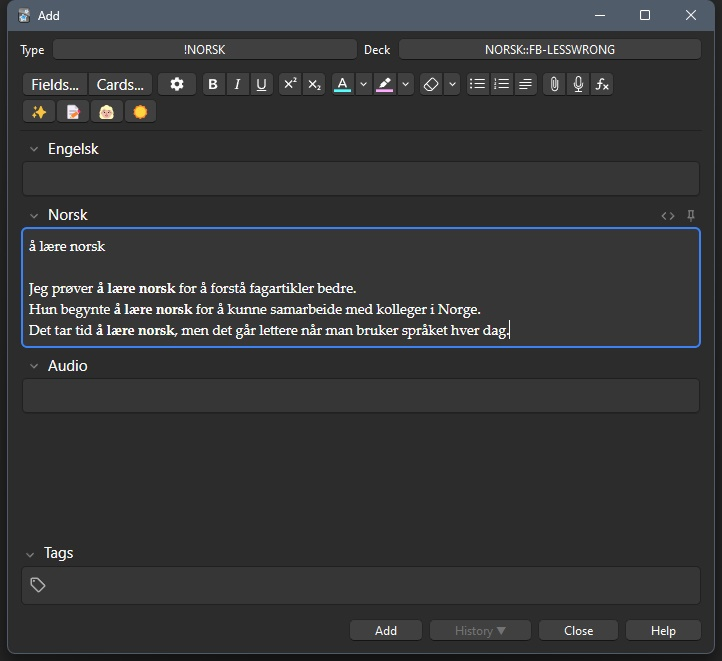
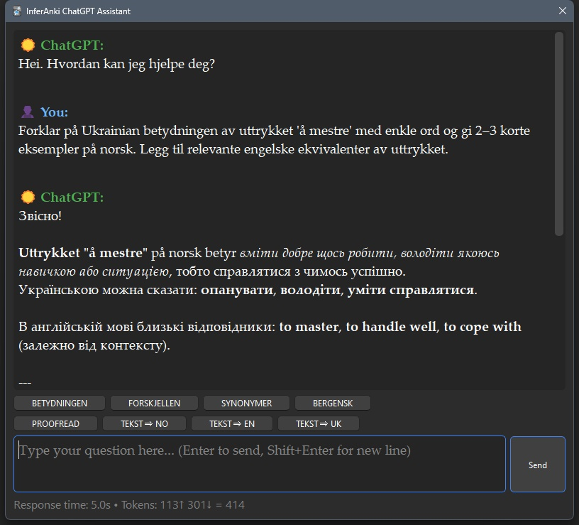

# InferAnki 0.6

AI-інструменти для вивчення норвезької мови безпосередньо в редакторі карток Anki Desktop.

Поточна dev-збірка: `0.6.9`.

## Можливості

- **CardCraft** – створює повну картку зі словотвірною родиною за одним норвезьким словом, додає визначення, приклади, контекстні речення та переклад налаштованою мовою.
- **Examples** – генерує два перевірені норвезькі приклади з вихідної фрази, нормалізує відступи в полі 2 та заповнює порожнє поле 1 перекладом налаштованою мовою. Після `*` можна вказати одноразову тематичну інструкцію.
- **TTS** – генерує норвезьке аудіо через ElevenLabs і прикріплює його до нотатки.
- **ChatGPT Assistant** – підтримує вільний чат, вісім налаштовуваних швидких промптів, копіювання в буфер і локальну пам’ять поточного діалогу. Відкривається з редактора, панелі Anki, меню Tools або через `Ctrl+G`.

CardCraft та Examples можуть використовувати частотність і колокації з корпусу DH-LAB Національної бібліотеки Норвегії. Компактні чернеткові етапи використовують Luna, а незалежні етапи перевірки та виправлення – Terra до запису в картку. Тривалі операції використовують нативне progress-вікно Anki, а поля картки застосовуються разом лише після успішного завершення пайплайна.

## Вимоги

- Anki Desktop `25.02.5` або новіша
- Інтернет для AI, корпусних і TTS-запитів
- API-ключ OpenAI для CardCraft, Examples і ChatGPT Assistant
- API-ключ ElevenLabs лише для TTS

Додаток розробляється й тестується на Windows 10/11. AnkiWeb і мобільні клієнти Anki не запускають desktop-аддони, але можуть показувати синхронізовані картки й аудіо, створені InferAnki. Інші desktop-операційні системи наразі не тестуються.

## Встановлення

1. Завантаж або клонуй цей репозиторій.
2. Скопіюй папку `InferAnki` до `%APPDATA%\Anki2\addons21\`.
3. Відкрий скопійований `InferAnki/config.json`.
4. Заміни `YOUR_OPENAI_API_KEY_HERE` своїм API-ключем OpenAI.
5. Якщо потрібен TTS, заміни `YOUR_ELEVENLABS_API_KEY_HERE` ключем ElevenLabs.
   [Спробуйте ElevenLabs](https://try.elevenlabs.io/l8ypk48ku2uk)
6. Перезапусти Anki.

InferAnki очікує щонайменше два поля нотатки:

- **Поле 1** – переклад мовою з `field_1_response_lang`
- **Поле 2** – норвезьке джерело та згенерований навчальний матеріал

Назви полів не мають значення – додаток використовує їхні позиції.

## Використання

Відкрий вікно додавання або редагування картки й використовуй кнопки редактора:

- `✨` – запустити CardCraft для норвезького слова в полі 2
- `📝` – згенерувати додаткові приклади з поля 2
- `👩🏼` – створити ElevenLabs-аудіо з поля 2
- `☀️` – відкрити ChatGPT Assistant

Examples підтримує одноразову інструкцію після зірочки. Наприклад:

```text
et sjakkbrett * використовуй лише шахові ситуації
```

## Конфігурація

`config.json` – єдине джерело правди для спільних runtime-налаштувань.

| Параметр | Призначення |
| --- | --- |
| `openai_default_model` | Спільна модель OpenAI; типово `gpt-5.6-terra` |
| `openai_draft_model` | Швидка модель для компактних чернеток; типово `gpt-5.6-luna` |
| `openai_reasoning_effort` | Спільний рівень reasoning |
| `openai_text_verbosity` | Спільна докладність відповідей |
| `openai_timeout_seconds` | Необов’язковий timeout OpenAI-запиту; типово 120 секунд, допустимо 30–600 |
| `field_1_response_lang` | Мова перекладу для поля 1 |
| `user_lang` | Значення мови користувача, доступне шаблонам промптів ChatGPT |
| `chatbot_max_history` | Кількість завершених пар повідомлень у межах діалогу |
| `tts_enabled` | Вмикає або вимикає ElevenLabs TTS |
| `tts_progress_threshold_chars` | Показує нативний TTS-progress понад цю довжину очищеного тексту |
| `openai_usage_log_enabled` | Записує secret-free статистику використаних токенів |
| `corpus_enabled` | Вмикає корпусні докази для норвезької мови |
| `corpus_eval_enabled` | Вмикає корпусні цикли перевірки й виправлення |
| `debug_mode` | Вмикає додаткову діагностику |

Ліміти токенів і виняткові model override для окремих промптів живуть у `prompts.json`. Зазвичай спільну модель слід змінювати лише в `config.json`.

### Персональний контекст

У публічному пресеті всі масиви `user_context` порожні. Щоб спрямувати приклади на власні інтереси, заповни потрібні масиви в `prompts.json`, наприклад:

```json
"user_context": ["medisin", "helse", "sykehus"]
```

Значення мають бути короткими й конкретними. Швидкі промпти налаштовуються окремо в `chatbot.quick_prompts`.

### Корпусна перевірка

Типові налаштування запитують норвезькі газетні матеріали за 2000–2025 роки через DH-LAB API. Частотність допомагає відкидати неправдоподібні або застарілі форми, а колокації – віддавати перевагу засвідченому сучасному вживанню. Сам corpus client працює за fail-open принципом, якщо сервіс недоступний, але обов’язковий evaluation stage може зупинити слабкий результат замість запису в картку.

Поведінку корпусу можна змінити через параметри `corpus_*` у `config.json`.

## Логи й діагностика

- Перезапускай Anki після зміни `config.json` або `prompts.json`.
- Логи CardCraft: `InferAnki/logs/convert-*.log`
- Linguistic QA receipts: `InferAnki/logs/linguistic-qa-*.json`
- Точне використання OpenAI: `InferAnki/logs/openai-usage.jsonl`
- Якщо довгі запити завершуються timeout-ом, додай або збільш `openai_timeout_seconds` у `config.json`.
- Для видиміших повідомлень про помилки встанови `debug_mode: true`.
- API-виклики використовують твої акаунти OpenAI та ElevenLabs і можуть оплачуватися за тарифами провайдерів.

Налаштування ChatGPT Assistant описано в [ChatBot-uk.md](ChatBot-uk.md). Англійська документація доступна в [README.md](README.md) та [ChatBot.md](ChatBot.md).

## Скриншоти

<table>
  <tr>
    <td width="50%"></td>
    <td width="50%"></td>
  </tr>
  <tr>
    <td width="50%"></td>
    <td width="50%"></td>
  </tr>
  <tr>
    <td colspan="2"></td>
  </tr>
</table>

## Внесок у проєкт

Багрепорти й pull request-и вітаються. Дивись [CONTRIBUTING.md](CONTRIBUTING.md).
